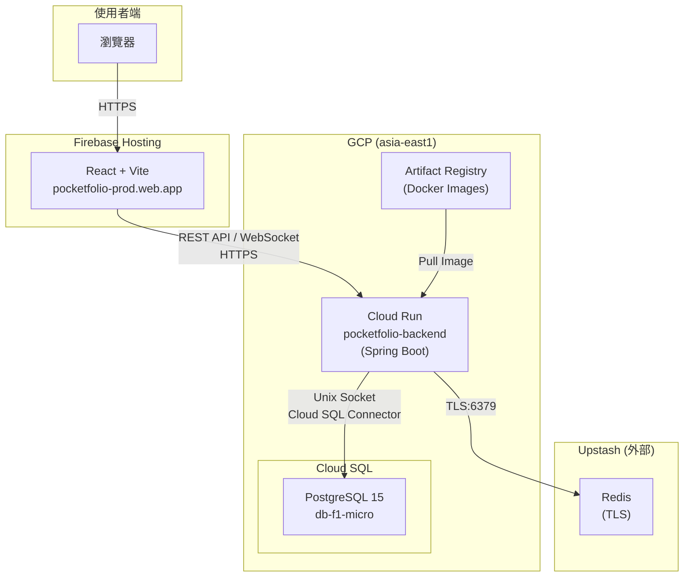
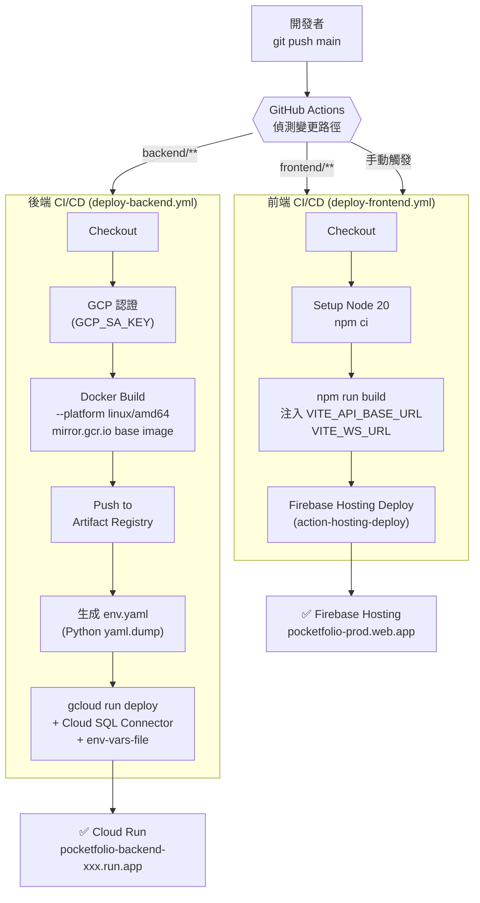

# 💰 PocketFolio - 個人財務管理系統

[](https://spring.io/projects/spring-boot)
[](https://www.oracle.com/java/)
[](https://react.dev/)
[](https://www.typescriptlang.org/)
[](https://www.postgresql.org/)
[](https://redis.io/)
[](https://cloud.google.com/run)
[](https://firebase.google.com/)

> 一個功能完整的個人財務管理系統，支援多用戶、即時價格追蹤、智能警報與歷史分析。

**🌐 線上體驗：[https://pocketfolio-prod.web.app](https://pocketfolio-prod.web.app)**

---

## 🌟 核心功能

### ✅ 已完成功能 (Phase 1-7)

| 功能模組 | 說明 | 狀態 |
|---------|------|------|
| **🔐 用戶認證** | JWT Token 認證、註冊/登入、密碼加密 | ✅ 完成 |
| **💳 交易管理** | 收支記錄 CRUD、多維度篩選、分類統計 | ✅ 完成 |
| **📁 類別管理** | 收入/支出類別、自定義分類 | ✅ 完成 |
| **🏦 帳戶管理** | 多帳戶支援、餘額追蹤、四種帳戶類型 | ✅ 完成 |
| **💎 資產追蹤** | 股票/加密貨幣持倉、成本計算、損益分析 | ✅ 完成 |
| **📊 統計分析** | 月度收支圖表、分類佔比、趨勢分析 | ✅ 完成 |
| **💹 即時報價** | CoinGecko + Yahoo Finance API 整合 | ✅ 完成 |
| **🔔 價格警報** | 自動監控、條件觸發、即時通知 | ✅ 完成 |
| **📸 歷史快照** | 資產快照、趨勢分析、投資組合歷史 | ✅ 完成 |
| **⚡ 即時推播** | WebSocket 價格更新、警報通知 | ✅ 完成 |
| **📖 API 文檔** | Swagger/OpenAPI 3 互動式文檔 | ✅ 完成 |
| **🐳 容器化部署** | Docker 多階段建構、GCP Cloud Run | ✅ 完成 |
| **🔁 CI/CD Pipeline** | GitHub Actions 自動化部署 | ✅ 完成 |

### 🚧 開發中功能

- [ ] Token 過期自動導向登入頁
- [ ] 手機版響應式優化
- [ ] Schema 遷移工具（Flyway）

---

## 🏗️ 系統架構

### 生產環境架構



### CI/CD 流程



---

## 🛠️ 技術棧

### 後端技術

| 技術 | 版本 | 用途 |
|------|------|------|
| Spring Boot | 3.5.10 | 主框架 |
| Spring Security | 6.x | 安全認證 |
| Spring Data JPA | 3.x | ORM 層 |
| PostgreSQL | 15 | 關聯式資料庫 |
| Redis | 7 | 快取層 |
| WebSocket + STOMP | - | 即時通訊 |
| JWT (jjwt) | 0.12.5 | Token 認證 |
| Swagger/OpenAPI | 3.0 | API 文檔 |
| Cloud SQL Connector | 1.22.0 | GCP 資料庫安全連線 |

### 前端技術

| 技術 | 版本 | 用途 |
|------|------|------|
| React | 18.2 | UI 框架 |
| TypeScript | 5.2 | 型別系統 |
| Vite | 5.1 | 建構工具 |
| Ant Design | 5.15 | UI 組件庫 |
| Zustand | 4.5 | 狀態管理 |
| Axios | 1.6 | HTTP 客戶端 |
| Recharts | 2.x | 圖表庫 |
| React Router | 6.22 | 路由管理 |

### 部署與基礎設施

| 技術 | 用途 |
|------|------|
| Docker (multi-stage build) | 後端容器化，JDK 建構 → JRE 執行，image ~138MB |
| GCP Cloud Run | 後端無伺服器容器執行環境 |
| GCP Artifact Registry | Docker Image 倉庫 |
| GCP Cloud SQL | 託管 PostgreSQL 資料庫 |
| Firebase Hosting | 前端靜態部署 + CDN |
| Upstash Redis | 雲端 Redis（TLS，Serverless） |
| GitHub Actions | CI/CD 自動化部署 |

### 外部服務

- **CoinGecko API** - 加密貨幣即時價格
- **Yahoo Finance API** - 股票即時報價

---

## 📦 專案結構

```
pocketfolio/
├── .github/
│   └── workflows/
│       ├── deploy-backend.yml   # 後端 CI/CD（push backend/** 觸發）
│       └── deploy-frontend.yml  # 前端 CI/CD（push frontend/** 觸發）
├── backend/                     # Spring Boot 後端
│   ├── src/main/java/com/pocketfolio/backend/
│   │   ├── config/              # 配置類（Security, Redis, WebSocket）
│   │   ├── controller/          # REST 控制器（39 APIs）
│   │   ├── dto/                 # 數據傳輸對象
│   │   │   ├── request/
│   │   │   ├── response/
│   │   │   ├── websocket/
│   │   │   └── external/
│   │   ├── entity/              # JPA 實體（7 個主要實體）
│   │   ├── repository/          # JPA Repository
│   │   ├── service/             # 業務邏輯
│   │   │   └── external/        # 外部 API 服務
│   │   ├── security/            # JWT + Spring Security
│   │   ├── scheduler/           # 定時任務
│   │   └── exception/           # 異常處理
│   ├── src/main/resources/
│   │   ├── application.yaml     # 本地開發設定
│   │   └── application-prod.yaml # 生產環境設定（Cloud SQL + Upstash）
│   ├── Dockerfile               # 多階段 Docker 建構
│   ├── .dockerignore
│   └── pom.xml
├── frontend/                    # React 前端
│   ├── src/
│   │   ├── api/                 # API 請求封裝（7 個服務）
│   │   ├── components/          # 通用組件
│   │   │   └── Layout/          # 主布局（Header + Sidebar）
│   │   ├── pages/               # 頁面組件（10+ 頁面）
│   │   │   ├── auth/
│   │   │   ├── transactions/
│   │   │   ├── categories/
│   │   │   ├── accounts/
│   │   │   ├── assets/
│   │   │   ├── alerts/
│   │   │   └── statistics/
│   │   ├── store/               # Zustand 狀態管理
│   │   ├── types/               # TypeScript 類型定義
│   │   ├── utils/               # 工具函數
│   │   ├── App.tsx
│   │   ├── main.tsx
│   │   └── router.tsx
│   ├── firebase.json            # Firebase Hosting 設定（SPA rewrite）
│   ├── .firebaserc              # Firebase 專案連結
│   ├── package.json
│   ├── vite.config.ts
│   └── tsconfig.json
├── docs/                        # 專案文檔
│   ├── PROJECT_CONTEXT.md
│   ├── CODING_STANDARDS.md
│   ├── TODO.md
│   └── dev_logs/                # 每日開發日誌
├── docker-compose.yaml          # 本地開發用（PostgreSQL + Redis）
└── README.md
```

---

## 🚀 快速開始（本地開發）

### 前置需求

- **Java 17+**
- **Maven 3.8+**（或使用專案內的 `mvnw`）
- **Node.js 20+**
- **Docker & Docker Compose**

### 1️⃣ 克隆專案

```bash
git clone https://github.com/Wise4466/pocketfolio.git
cd pocketfolio
```

### 2️⃣ 啟動本地資料庫

```bash
docker-compose up -d
```

這會啟動：
- PostgreSQL 15（port 5432）
- Redis 7（port 6379）

### 3️⃣ 啟動後端

```bash
cd backend
./mvnw spring-boot:run
```

後端啟動於 `http://localhost:8080`

### 4️⃣ 啟動前端

```bash
cd frontend
npm install
npm run dev
```

前端啟動於 `http://localhost:5173`

### 5️⃣ 訪問應用

| 服務 | URL |
|------|-----|
| 前端應用 | http://localhost:5173 |
| Swagger UI | http://localhost:8080/swagger-ui.html |
| WebSocket 測試頁 | http://localhost:8080/ws-test.html |

---

## ☁️ 生產環境

### 環境資訊

| 服務 | URL / 位置 |
|------|-----------|
| 前端 | https://pocketfolio-prod.web.app |
| 後端 API | GCP Cloud Run（asia-east1） |
| 資料庫 | GCP Cloud SQL（PostgreSQL 15，asia-east1） |
| 快取 | Upstash Redis（TLS） |
| Docker Image | GCP Artifact Registry（asia-east1） |

### 部署方式

推送到 `main` 分支後 GitHub Actions 自動觸發：

- `backend/**` 有變更 → 建構 Docker image → 部署到 Cloud Run
- `frontend/**` 有變更 → `npm run build` → 部署到 Firebase Hosting
- 前端也可在 GitHub Actions UI 手動觸發（`workflow_dispatch`）

### 需要設定的 GitHub Secrets

| Secret | 用途 |
|--------|------|
| `GCP_SA_KEY` | GCP Service Account JSON（後端部署 + Firebase） |
| `DB_USERNAME` | Cloud SQL 使用者名稱 |
| `DB_PASSWORD` | Cloud SQL 密碼 |
| `JWT_SECRET` | JWT 簽名金鑰 |
| `REDIS_HOST` | Upstash Redis 主機 |
| `REDIS_PORT` | Upstash Redis 連接埠 |
| `REDIS_PASSWORD` | Upstash Redis 密碼 |
| `REDIS_SSL_ENABLED` | Redis TLS 開關（`true`） |
| `VITE_API_BASE_URL` | 前端使用的後端 API URL |
| `VITE_WS_URL` | 前端使用的 WebSocket URL |

---

## 📊 API 概覽

| 模組 | 端點 | 數量 | 說明 |
|------|------|------|------|
| 認證 | `/api/auth` | 2 | 註冊、登入（公開） |
| 交易記錄 | `/api/transactions` | 5 | CRUD + 篩選 |
| 類別管理 | `/api/categories` | 5 | CRUD + 類型篩選 |
| 帳戶管理 | `/api/accounts` | 5 | CRUD + 類型/搜尋 |
| 資產管理 | `/api/assets` | 5 | CRUD + 帳戶關聯 |
| 價格管理 | `/api/prices` | 5 | 查詢/更新/快取 |
| 價格警報 | `/api/price-alerts` | 6 | CRUD + 啟用切換 |
| 統計分析 | `/api/statistics` | 2 | 月度統計/帳戶餘額 |
| 資產快照 | `/api/snapshots` | 4 | 快照/歷史趨勢 |

**總計：39 個 REST API**

完整文檔：Swagger UI（本地 `http://localhost:8080/swagger-ui.html`）

---

## ⚡ 核心特性

### 🔒 安全性

- **JWT Token 認證** - 24 小時有效期
- **密碼加密** - BCrypt 演算法
- **資料隔離** - 用戶只能存取自己的資料
- **CORS 保護** - 限制來源網域（本地 + Firebase Hosting）
- **非 root 容器** - Docker 以 `appuser` 執行
- **Cloud SQL Auth Connector** - Unix socket 連線，資料庫不對外開放

### 📈 效能優化

- **Redis 快取** - 價格資料 5 分鐘 TTL
- **@Cacheable 註解** - Spring Cache 抽象
- **Docker 多階段建構** - JDK 建構 + JRE 執行，最終 image ~138MB
- **Layer Cache** - Dockerfile 先複製 `pom.xml` 再複製 src，加速重複建構
- **分頁查詢** - 避免大量資料載入

### 🔄 即時功能

- **WebSocket 連接** - SockJS + STOMP
- **價格更新推播** - `/topic/price-updates`
- **警報通知** - `/user/queue/alerts`

### ⚙️ 定時任務

| 任務 | 執行時間 | 說明 |
|------|---------|------|
| 價格更新 | 每 5 分鐘 | 更新所有資產的即時價格 |
| 快照建立 | 每天凌晨 1 點 | 建立每日資產快照 |
| 快取清除 | 每天凌晨 3 點 | 清除過期的價格快取 |

---

## 🎯 開發進度

### Phase 1-2: 基礎架構 ✅
Spring Boot + PostgreSQL，CRUD 功能，基礎實體設計

### Phase 3: 安全與多用戶 ✅
JWT 認證，資料隔離，Spring Security

### Phase 4: 即時整合 ✅
Redis 快取，外部 API（CoinGecko / Yahoo Finance），WebSocket，定時任務

### Phase 5: React 前端 ✅
基礎頁面，Zustand 狀態管理，API 整合

### Phase 6: 進階功能 ✅
資產管理，統計圖表，價格警報，歷史快照

### Phase 7: 部署與 CI/CD ✅
Docker 多階段建構，GCP Cloud Run，Firebase Hosting，GitHub Actions Pipeline，Cloud SQL Auth Connector，Upstash Redis（TLS）

---

## 🔧 故障排除

### 本地開發

**無法連接資料庫**
```bash
docker ps | grep postgres
docker-compose down && docker-compose up -d
```

**Redis 連線失敗**
```bash
docker exec -it pocketfolio-redis redis-cli ping
# 應回傳 PONG
```

**前端 API 請求 401**

清除 localStorage 並重新登入：
```javascript
localStorage.removeItem('token')
```

### 生產環境排查

**查看 Cloud Run 日誌**
```bash
gcloud run services logs read pocketfolio-backend --region=asia-east1 --limit=50
```

**查看當前部署版本**
```bash
gcloud run services describe pocketfolio-backend --region=asia-east1 --format="value(status.url)"
```

---

## 📖 文檔

| 文檔 | 說明 |
|------|------|
| [PROJECT_CONTEXT.md](docs/PROJECT_CONTEXT.md) | 專案上下文與設計決策 |
| [CODING_STANDARDS.md](docs/CODING_STANDARDS.md) | 編碼規範與最佳實踐 |
| [TODO.md](docs/TODO.md) | 待辦事項與開發計劃 |
| [dev_logs/](docs/dev_logs/) | 每日開發日誌 |

---

## 📊 專案統計

- **後端代碼：** ~15,000 行
- **前端代碼：** ~8,000 行
- **實體數量：** 7 個
- **API 端點：** 39 個
- **前端頁面：** 10+ 個

---

## 📄 授權

MIT License

---

## 📧 聯絡方式

- **Email:** 91211wise@gmail.com
- **GitHub:** https://github.com/Wise4466/pocketfolio
- **Issues:** https://github.com/Wise4466/pocketfolio/issues

---

**⭐ 如果這個專案對你有幫助，請給個 Star！**
