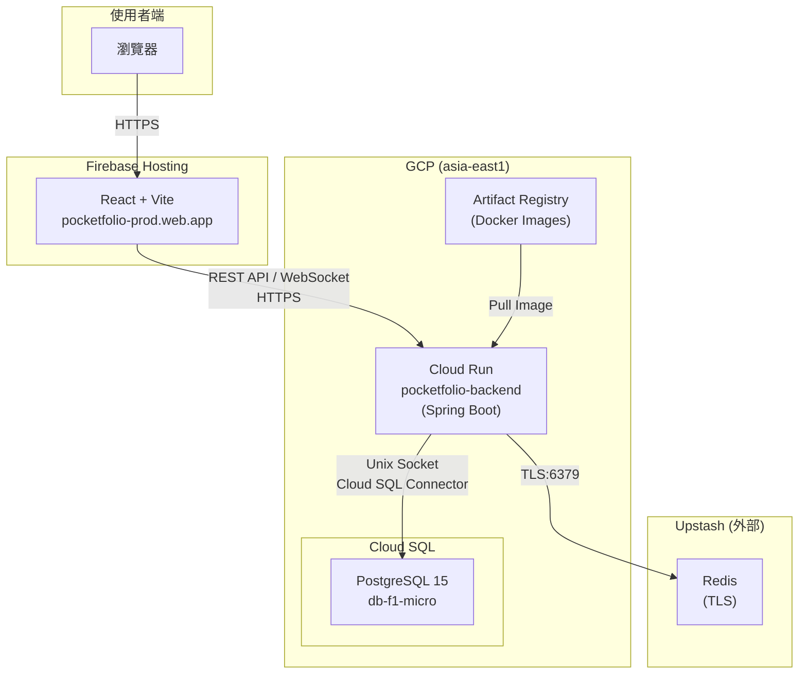
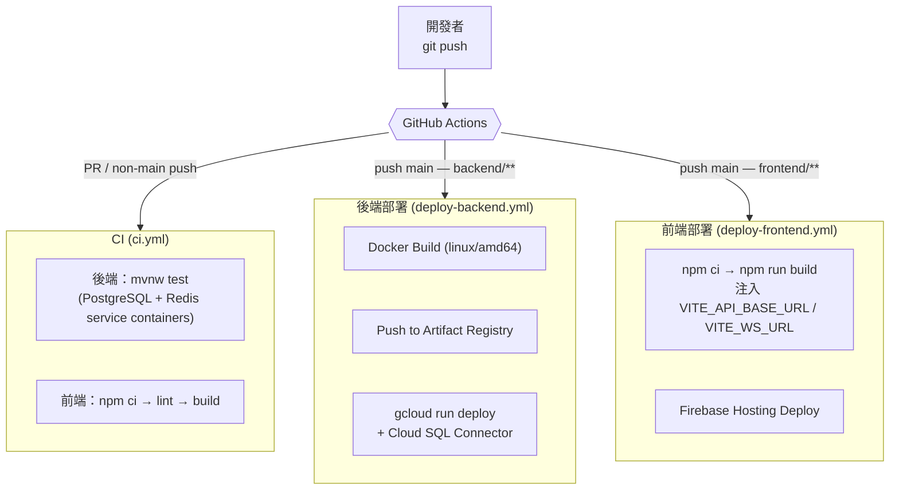

# 系統架構

## 生產環境架構



## CI/CD 流程



---

## 技術棧

### 後端

| 技術 | 版本 | 用途 |
|------|------|------|
| Spring Boot | 3.5 | 主框架 |
| Spring Security | 6.x | JWT 認證 |
| Spring Data JPA | 3.x | ORM |
| PostgreSQL | 15 | 關聯式資料庫 |
| Redis | 7 | 價格快取（5 分鐘 TTL） |
| WebSocket + STOMP | - | 即時推播 |
| JWT (jjwt) | 0.12.5 | Token 認證 |
| Swagger/OpenAPI | 3.0 | API 文檔 |
| Cloud SQL Connector | 1.22.0 | Unix socket 連線 |

### 前端

| 技術 | 版本 | 用途 |
|------|------|------|
| React | 18.2 | UI 框架 |
| TypeScript | 5.2 | 型別系統 |
| Vite | 5.1 | 建構工具 |
| Ant Design | 5.x | UI 組件庫 |
| Zustand | 4.5 | 狀態管理（persisted） |
| Axios | 1.6 | HTTP 客戶端（自動注入 Bearer token） |
| Recharts | 2.x | 統計圖表 |
| React Router | 6.x | 路由（PrivateRoute / PublicRoute） |

### 基礎設施

| 技術 | 用途 |
|------|------|
| Docker multi-stage build | JDK 建構 → JRE 執行，image ~138MB |
| GCP Cloud Run | 後端無伺服器容器，HikariCP pool-size=5（避免 Cloud SQL 連線上限） |
| GCP Cloud SQL | PostgreSQL 15，db-f1-micro，asia-east1 |
| Firebase Hosting | 前端靜態部署 + CDN |
| Upstash Redis | 雲端 Redis（TLS，Serverless） |
| GitHub Actions | CI 測試 + CD 部署 |

---

## API 概覽

| 模組 | 端點 | 說明 |
|------|------|------|
| 認證 | `/api/auth` | 註冊、登入（公開） |
| 交易記錄 | `/api/transactions` | CRUD + 篩選 |
| 類別管理 | `/api/categories` | CRUD + 類型篩選 |
| 帳戶管理 | `/api/accounts` | CRUD + 類型篩選 |
| 資產管理 | `/api/assets` | CRUD + 購買扣款 |
| 價格管理 | `/api/prices` | 查詢 / 更新 / 快取 |
| 價格警報 | `/api/price-alerts` | CRUD + 啟用切換 |
| 統計分析 | `/api/statistics` | 月度統計 / 帳戶餘額 |
| 資產快照 | `/api/snapshots` | 快照 / 歷史趨勢 |

完整互動文檔：`http://localhost:8080/swagger-ui.html`

---

## 專案結構

```
pocketfolio/
├── .github/workflows/
│   ├── ci.yml                  # PR / non-main push：後端測試 + 前端 lint/build
│   ├── deploy-backend.yml      # push main backend/**：Cloud Run
│   └── deploy-frontend.yml     # push main frontend/**：Firebase Hosting
├── backend/src/main/java/com/pocketfolio/backend/
│   ├── config/                 # Security, Redis, WebSocket
│   ├── controller/             # REST 控制器
│   ├── dto/                    # Request / Response / WebSocket / External
│   ├── entity/                 # JPA 實體（7 個）
│   ├── repository/             # JPA Repository
│   ├── service/                # 業務邏輯
│   │   └── external/           # CoinGeckoService, YahooFinanceService
│   ├── security/               # JwtAuthenticationFilter, SecurityUtil
│   ├── scheduler/              # 價格更新 / 快照 / 資產同步 / 快取清除
│   └── exception/              # GlobalExceptionHandler
├── frontend/src/
│   ├── api/                    # 一個 domain 一個檔案，共用 axios instance
│   ├── pages/                  # 頁面組件
│   ├── store/                  # authStore, websocketStore
│   ├── types/                  # TypeScript 型別
│   └── router.tsx              # PrivateRoute / PublicRoute
└── docs/
```

---

## 故障排除

### 本地開發

**無法連接資料庫**
```bash
docker ps | grep postgres
docker-compose down && docker-compose up -d
```

**Redis 連線失敗**
```bash
docker exec -it pocketfolio-redis redis-cli ping
# 應回傳 PONG
```

**前端 API 401**
```javascript
localStorage.removeItem('token')  // 清除後重新登入
```

### 生產環境

**查看 Cloud Run 日誌**
```bash
gcloud run services logs read pocketfolio-backend --region=asia-east1 --limit=50
```

**GitHub Secrets 清單**

| Secret | 用途 |
|--------|------|
| `GCP_SA_KEY` | GCP Service Account JSON |
| `DB_USERNAME` / `DB_PASSWORD` | Cloud SQL 認證 |
| `JWT_SECRET` | JWT 簽名金鑰 |
| `REDIS_HOST` / `REDIS_PORT` / `REDIS_PASSWORD` | Upstash Redis |
| `REDIS_SSL_ENABLED` | `true` |
| `VITE_API_BASE_URL` / `VITE_WS_URL` | 前端注入的後端 URL |
