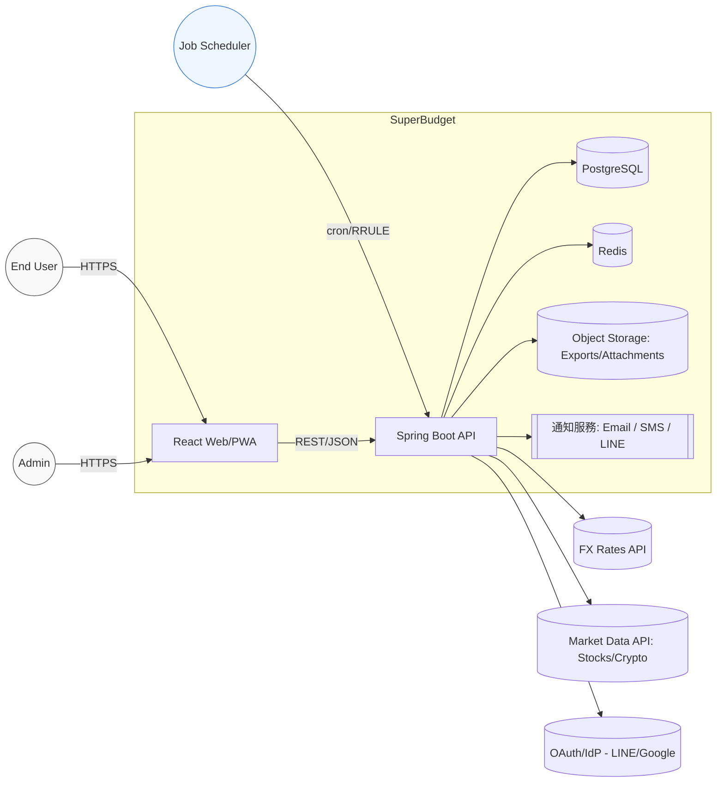
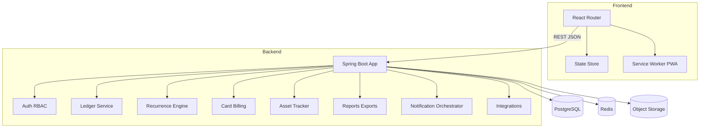
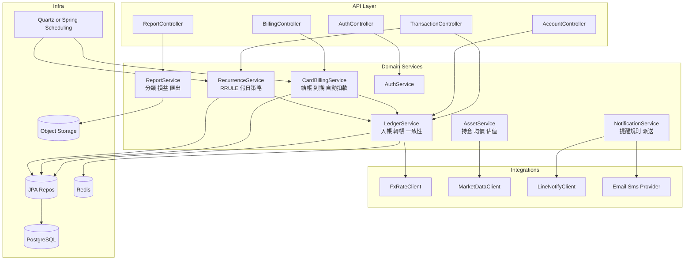
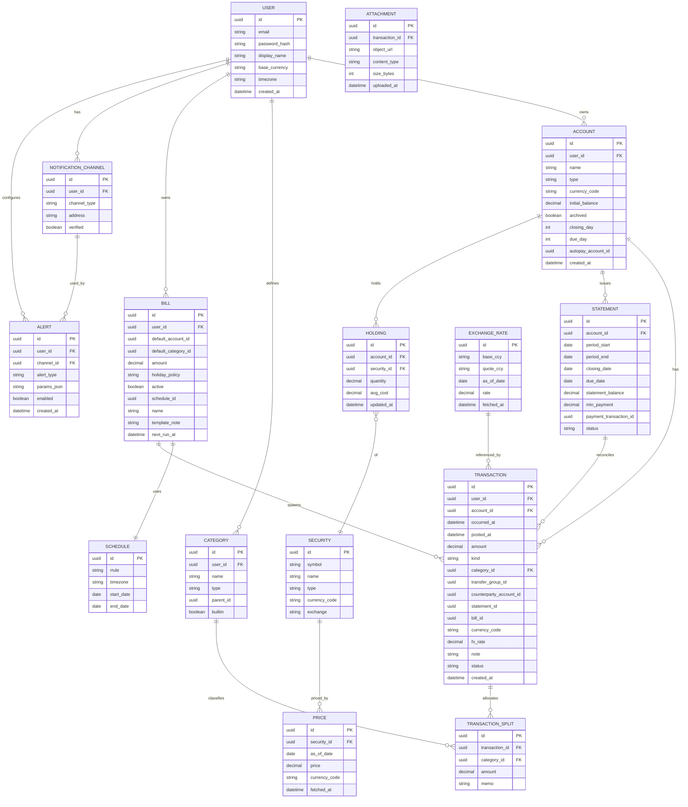

# 技術草圖（C4-L1/L2/L3＋ERD）

## C4-L1 系統脈絡（超級記帳程式）

```mermaid
graph LR
  %% Actors
  User((End User)):::actor -->|HTTPS| Web[React Web/PWA]
  Admin((Admin)):::actor -->|HTTPS| Web
  Scheduler((Job Scheduler)):::infra -->|cron/RRULE| API

  %% System boundary
  subgraph SuperBudget
    Web -->|REST/JSON| API[Spring Boot API]
    API --> DB[(PostgreSQL)]
    API --> Cache[(Redis)]
    API --> Obj[(Object Storage: Exports/Attachments)]
    API --> Notif[[通知服務: Email / SMS / LINE]]
  end

  %% External deps
  API --> FX[(FX Rates API)]
  API --> Mkt[(Market Data API: Stocks/Crypto)]
  API --> IdP[(OAuth/IdP - LINE/Google)] 

  classDef actor fill:#f9f9f9,stroke:#555;
  classDef infra fill:#eef7ff,stroke:#3a7bd5,stroke-width:1px;
```

## C4-L2 容器圖

```mermaid
graph TD
  subgraph Frontend
    FE[React Router] --> SM[State Store]
    FE --> SW[Service Worker PWA]
  end

  subgraph Backend
    SVC[Spring Boot App]
    AUTH[Auth RBAC]
    LEDGER[Ledger Service]
    REC[Recurrence Engine]
    BILLING[Card Billing]
    ASSET[Asset Tracker]
    REPORTS[Reports Exports]
    NOTIF[Notification Orchestrator]
    INTEG[Integrations]
  end

  FE -->|REST JSON| SVC
  SVC --> AUTH
  SVC --> LEDGER
  SVC --> REC
  SVC --> BILLING
  SVC --> ASSET
  SVC --> REPORTS
  SVC --> NOTIF
  SVC --> INTEG

  SVC --> PG[(PostgreSQL)]
  SVC --> REDIS[(Redis)]
  SVC --> OBJ[(Object Storage)]
```

## C4-L3 後端元件圖（重點模組）

```mermaid
graph TD
  subgraph API Layer
    CtlTx[TransactionController]
    CtlAcct[AccountController]
    CtlBill[BillingController]
    CtlRpt[ReportController]
    CtlAuth[AuthController]
  end

  subgraph Domain Services
    S_Ledger[LedgerService<br/>入帳 轉帳 一致性]
    S_Rec[RecurrenceService<br/>RRULE 假日策略]
    S_Bill[CardBillingService<br/>結帳 到期 自動扣款]
    S_Asset[AssetService<br/>持倉 均價 估值]
    S_Rpt[ReportService<br/>分類 損益 匯出]
    S_Notif[NotificationService<br/>提醒規則 派送]
    S_Auth[AuthService]
  end

  subgraph Integrations
    FX[FxRateClient]
    MKT[MarketDataClient]
    LINE[LineNotifyClient]
    SMTP[Email Sms Provider]
  end

  subgraph Infra
    Repo[(JPA Repos)]
    Cache[(Redis)]
    DB[(PostgreSQL)]
    Store[(Object Storage)]
    Sched[Quartz or Spring Scheduling]
  end

  CtlTx --> S_Ledger
  CtlTx --> S_Rec
  CtlAcct --> S_Ledger
  CtlBill --> S_Bill
  CtlRpt --> S_Rpt
  CtlAuth --> S_Auth

  S_Bill --> S_Ledger
  S_Rec --> S_Ledger
  S_Asset --> MKT
  S_Ledger --> Repo
  S_Bill --> Repo
  S_Rec --> Repo
  S_Rpt --> Store
  Repo --> DB
  S_Ledger --> Cache
  S_Notif --> LINE
  S_Notif --> SMTP
  S_Ledger --> FX
  Sched --> S_Rec
  Sched --> S_Bill
```

## ERD

```mermaid
erDiagram
  USER ||--o{ ACCOUNT : owns
  USER ||--o{ CATEGORY : defines
  USER ||--o{ BILL : owns
  USER ||--o{ NOTIFICATION_CHANNEL : has
  USER ||--o{ ALERT : configures

  ACCOUNT ||--o{ TRANSACTION : has
  ACCOUNT ||--o{ STATEMENT : issues
  ACCOUNT ||--o{ HOLDING : holds

  TRANSACTION ||--o{ TRANSACTION_SPLIT : allocates
  CATEGORY ||--o{ TRANSACTION_SPLIT : classifies

  BILL ||--|| SCHEDULE : uses
  BILL ||--o{ TRANSACTION : spawns

  STATEMENT ||--o{ TRANSACTION : reconciles
  HOLDING }o--|| SECURITY : of
  SECURITY ||--o{ PRICE : priced_by

  EXCHANGE_RATE ||--o{ TRANSACTION : referenced_by
  NOTIFICATION_CHANNEL ||--o{ ALERT : used_by

  USER {
    uuid id PK
    string email
    string password_hash
    string display_name
    string base_currency
    string timezone
    datetime created_at
  }

  ACCOUNT {
    uuid id PK
    uuid user_id FK
    string name
    string type
    string currency_code
    decimal initial_balance
    boolean archived
    int closing_day
    int due_day
    uuid autopay_account_id
    datetime created_at
  }

  CATEGORY {
    uuid id PK
    uuid user_id FK
    string name
    string type
    uuid parent_id
    boolean builtin
  }

  TRANSACTION {
    uuid id PK
    uuid user_id FK
    uuid account_id FK
    datetime occurred_at
    datetime posted_at
    decimal amount
    string kind
    uuid category_id FK
    uuid transfer_group_id
    uuid counterparty_account_id
    uuid statement_id
    uuid bill_id
    string currency_code
    decimal fx_rate
    string note
    string status
    datetime created_at
  }

  TRANSACTION_SPLIT {
    uuid id PK
    uuid transaction_id FK
    uuid category_id FK
    decimal amount
    string memo
  }

  BILL {
    uuid id PK
    uuid user_id FK
    uuid default_account_id
    uuid default_category_id
    decimal amount
    string holiday_policy
    boolean active
    uuid schedule_id
    string name
    string template_note
    datetime next_run_at
  }

  SCHEDULE {
    uuid id PK
    string rrule
    string timezone
    date start_date
    date end_date
  }

  STATEMENT {
    uuid id PK
    uuid account_id FK
    date period_start
    date period_end
    date closing_date
    date due_date
    decimal statement_balance
    decimal min_payment
    uuid payment_transaction_id
    string status
  }

  SECURITY {
    uuid id PK
    string symbol
    string name
    string type
    string currency_code
    string exchange
  }

  HOLDING {
    uuid id PK
    uuid account_id FK
    uuid security_id FK
    decimal quantity
    decimal avg_cost
    datetime updated_at
  }

  PRICE {
    uuid id PK
    uuid security_id FK
    date as_of_date
    decimal price
    string currency_code
    datetime fetched_at
  }

  EXCHANGE_RATE {
    uuid id PK
    string base_ccy
    string quote_ccy
    date as_of_date
    decimal rate
    datetime fetched_at
  }

  NOTIFICATION_CHANNEL {
    uuid id PK
    uuid user_id FK
    string channel_type
    string address
    boolean verified
  }

  ALERT {
    uuid id PK
    uuid user_id FK
    uuid channel_id FK
    string alert_type
    string params_json
    boolean enabled
    datetime created_at
  }

  ATTACHMENT {
    uuid id PK
    uuid transaction_id FK
    string object_url
    string content_type
    int size_bytes
    datetime uploaded_at
  }
```
